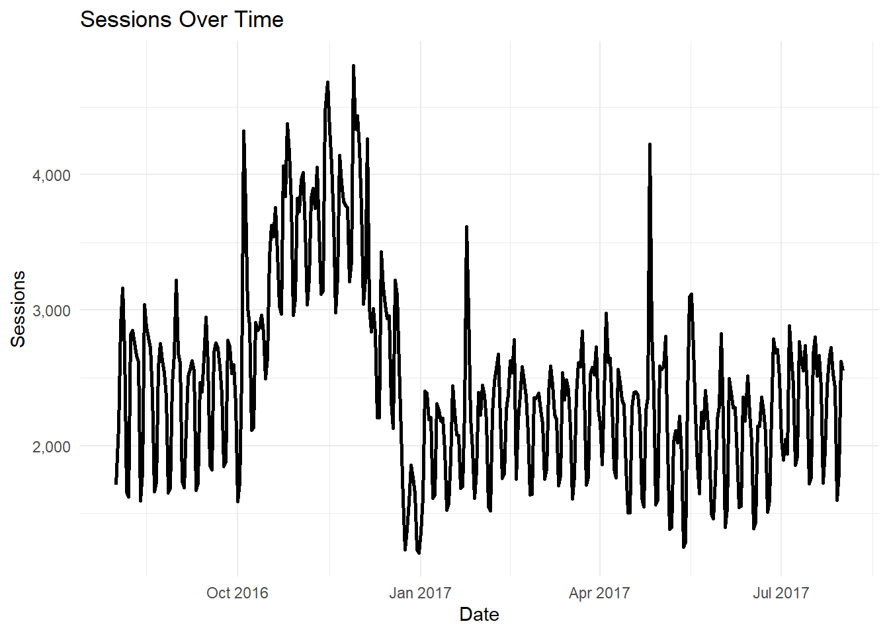
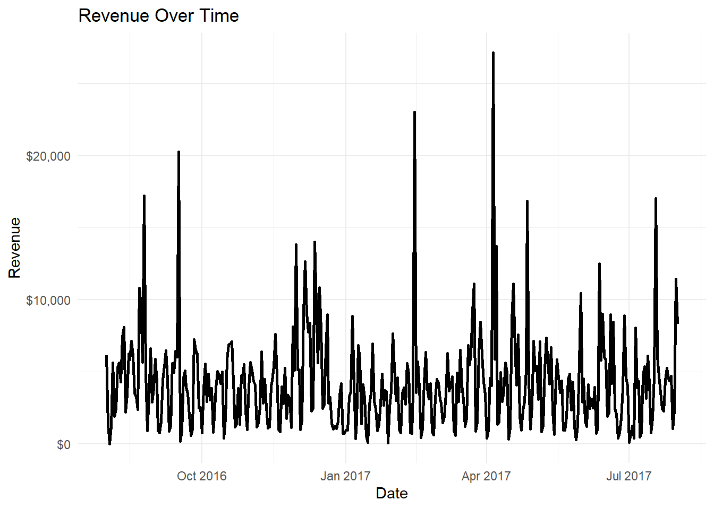

# Business Problem

## What is the challenge?

- The client wants to understand:
  - Which traffic sources drive revenue
  - Which users convert best
- Goal: 👉 Improve **conversion rate and revenue efficiency**

------------------------------------------------------------------------

# Data & Approach

## What we used

- Google Analytics Sample Dataset (BigQuery)
- Built a clean analytical mart
- Metrics:
  - Sessions
  - Transactions
  - Revenue
  - Conversion Rate

------------------------------------------------------------------------

# Key KPI Overview

## What is happening overall?

- \~900K sessions
- \~12K transactions
- \~\$1.5M revenue
- Conversion rate ≈ 1.3%

👉 Insight: - High traffic, but relatively low conversion efficiency

------------------------------------------------------------------------

# Traffic Trends

## Sessions Over Time

👉 Insight:

-  Traffic is stable with minor fluctuations

-  No major growth trend

# Revenue Trends

## Revenue Over Time

👉 Insight:

-  Revenue follows traffic patterns

-  No strong upward momentum

# Acquisition Performance

## Which sources drive revenue?

👉 Insight:

-  Few sources generate most revenue

-  Long tail of low-value sources

# Conversion Efficiency

## Which sources convert best?
